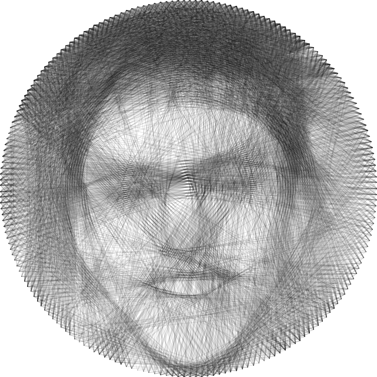

# PictureLoom
 Java program to make any photograph into a circular loom design using the [Processing](https://processing.org/) and the [G4P](http://www.lagers.org.uk/g4p/) libraries.
 

**Instructions:**
* Install Java if it is not already installed
* Download and Run PictureLoom.jar
* Set the loom properties (optional)
* Click 'Load Image' to pick an image to loom\
-OR-
* Click 'Load File' to load a previously started loom, then you will be prompted to choose the image file (need both the .txt and image file)

**Controls:** These keys can be used while running the program
* *SPACEBAR*: Pauses the program
* *I*: Shows the original image
* *S*: Saves the currently generated image and text file
* *R*: Clears the screen and redraws the strings that have already been generated (use this for animating your image quickly)

**Output:** after successfully completeting a loom, these files are created in the same directory as the source image
* Image file of the loom creation (e.g. \[photo\_name\]\_string.jpeg)
* Text file of a list of pegs in order to create it (e.g. \[photo\_name\]\_string.txt)
* Embroidery file that can be used on an embroidery machine to recreate the loom in real life (see Embroidery section)

**Loom Properties:**
The default loom properties are OK for giving decent images in a managable time in general, but can be tweaked for better quality or performance.  
* **Number of Pegs** - This is the number of pegs that are around the circular loom. The more pegs, the finer the resolution. Making this an even number may cause the program to crash.  
* **Minimum Gap** - The program skips this many pegs on both sides of the current peg when picking the next peg to tie the string to.  
* **Max Moves** - This is how many strings the program will weave (unless paused or stopped early).  
* **Line Weight** - This is how "thick" the string is. It is actually a measure of opacity (0-255).

**Embroidery:**
This feature is a bit experimental and may not work 100% of the time. The program attempts to create a .exp file (basic embroidery file) that can be read by most embroidery machines. I have tested 1 design on a Singer Futura SES 2000 and it worked. On my machine it creates the design backwards and upside down in a 10cm diameter circle. It uses a *lot* of thread and I would suggest using a design with a low 'Max Moves' and a high 'Line Weight' (around 70). Make sure all your machine's settings are correct and make sure the cloth is stretched very well in the hoop.

**Tips:**
* For a good quality loom of a complex image, the program will probably take upwards of an hour to complete
* Images are automatically resized to square of a maximum of 700x700 pixels and a grayscale filter is applied
   * It's recommended to crop your image into a square beforehand so that it does not get squished
* Bigger pictures take a longer time
   * It's recommended to resize your image beforehand to be small (500x500 is much faster than the 700x700 maximum)
* Images with better contrast usually turn out better
* For a better quality image...
   * Increase 'Max Moves'
   * Increase 'Number of Pegs'
   * Try decreasing 'Line Weight'
* For a faster image do the opposite and increase 'Minimum Gap'
* If you are getting many dark lines around the border or through the image where there shouldn't be any, your 'Max Moves' and/or 'Line Weight' is too high
